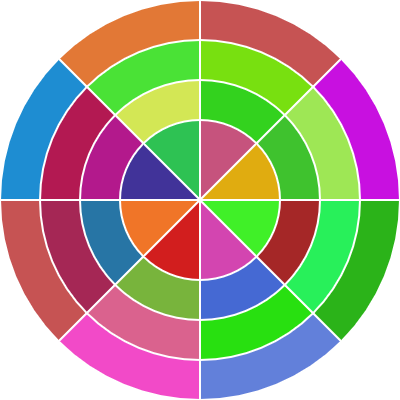

# hashvatar-p5js
Port of Francois Best's hashvatar to p5js

p5js: https://p5js.org/
Francois Best's hashvatars: https://francoisbest.com/posts/2021/hashvatars
- License: https://github.com/franky47/francoisbest.com/blob/next/LICENSE.txt

Work in progress...

Done: Basic display with random values

## ToDo

*  Parse input hash and generate real image
*  Souls
*  Staggering
*  Convert to class

## Notes

*  Uses p5js canvas, not SVG
*  blendFactor is bogus/broken

